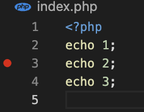
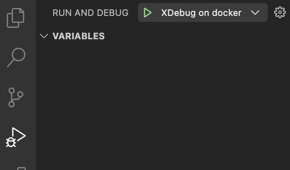

vscode with xdebug for php5

run

```
docker build -t x . && docker run -it -p 8000:80 -v $(pwd):/var/www/html x
```

open http://localhost:8000/. If it went well, you will see `123` on browser.

Now set a breakpoint on a line of index.php



then run xdebug



open http://localhost:8000/ again. it will stop by the breakpoint
